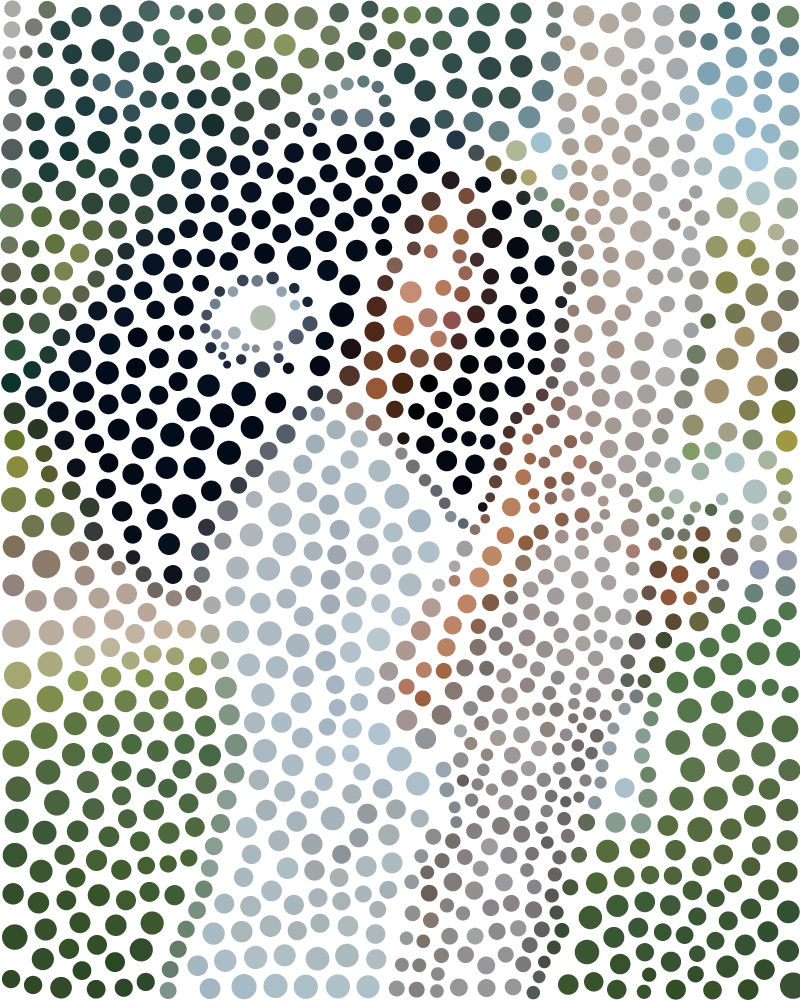

# pointimg

[](https://github.com/pvtc/pointimg/releases)
[](LICENSE)
[](https://www.rust-lang.org)
[](https://www.rust-lang.org)

Filtre pointilliste qui transforme une image en une composition de points colorés de tailles variables. Chaque point prend la couleur moyenne de sa zone et son rayon est modulé par la luminance et la variance locale.

## Fonctionnalités

- **4 algorithmes** : Grille, K-means, Voronoi (Lloyd pondéré), Quadtree adaptatif
- **4 formes de points** : Cercle, Carré, Ellipse (aspect + rotation), Polygone régulier (3-12 côtés)
- **Density map** : redistribution automatique des points selon le détail local
- **Export PNG et SVG** vectoriel
- **GUI interactive** (egui/wgpu) avec preview progressive et drag & drop
- **CLI** avec tous les paramètres accessibles
- **Palette réduite** optionnelle (quantification des couleurs)
- **Fond personnalisable** : blanc, noir, n'importe quelle couleur `#rrggbb`, ou `transparent` (sortie RGBA)
- **Correction gamma** optionnelle : les moyennes sont calculées en espace linéaire ; le chemin CMJN halftone conserve une précision `f32`, tandis que les autres algorithmes restent en RGB8
- **Rendu anti-aliasé** : supersampling 4×4 (pas d'effet escalier)
- **Traitement par lot** : glob/dossier en entrée, pattern par fichier (`{n}`, `{stem}`, `{name}`)
- **Prévisualisation rapide** : sous-échantillonnage source via `--preview WxH`
- **Presets** : charge/sauvegarde les paramètres dans un TOML versionné (les anciens presets plats restent lisibles)
- **Dithering Floyd-Steinberg** sur la palette quantifiée (effet offset-print)
- **Angle de trame halftone** : rotation de la grille via `--grid-angle`
- **Rosette CMJN** & **halftone N couleurs dominantes** (`--halftone cmyk|dominant-N`) — mélange soustractif multiply, screening AM (grille rotationée) ou FM (blue noise stochastique)
- **Formats de sortie** : PNG/JPEG/BMP/TIFF/WebP par défaut ; AVIF via `--features avif`
- **Profils colorimétriques** : profils ICC d'entrée détectés automatiquement, sRGB, Display-P3 ou fichiers `.icc` via `--input-profile` et `--output-profile`
- **Density map GPU optionnelle** : compiler avec `--features gpu`, activer avec
  `POINTIMG_GPU=1` ; fallback CPU/SAT automatique
- **Protection des ressources** : dimensions vérifiées avant décodage, maximum 8M de pixels,
  paramètres de complexité bornés et exports écrits atomiquement

## Exemples

| Source                                                                                       | Résultat (Voronoi, 1200 points)                |
| -------------------------------------------------------------------------------------------- | ---------------------------------------------- |
| [`pexels-kofishelbyfotos-38152015.jpg`](assets/examples/pexels-kofishelbyfotos-38152015.jpg) |  |

Images de test : [`kilauea25_0.jpeg`](assets/examples/kilauea25_0.jpeg),
[`pexels-kofishelbyfotos-38152015.jpg`](assets/examples/pexels-kofishelbyfotos-38152015.jpg),
[`pexels-ruyan-ayten-153760-4190725.jpg`](assets/examples/pexels-ruyan-ayten-153760-4190725.jpg).

## Installation

### Binaires pré-compilés

Téléchargez les binaires depuis la page [Releases](https://github.com/pvtc/pointimg/releases) pour votre plateforme :

- Linux (x86_64, ARM64)
- macOS (Intel, Apple Silicon, Universel)
- Windows (x86_64)

### Compilation depuis les sources

```bash
cargo build --release
```

Les binaires sont dans `target/release/` :

- `pointimg` -- outil CLI
- `pointimg-gui` -- application GUI (nécessite Vulkan ou OpenGL)

Pour compiler uniquement le CLI (sans les dépendances GUI) :

```bash
cargo build --release --no-default-features
```

## Utilisation CLI

```bash
# Voronoi, 1500 points, fond blanc
pointimg -i photo.jpg -o result.png --algorithm voronoi --num-points 1500

# Utiliser un profil ICC d'entrée (détection automatique par défaut)
pointimg -i photo-p3.jpg -o result.png --input-profile display-p3

# Convertir et embarquer un profil ICC de sortie
pointimg -i photo.jpg -o result.png --output-profile display-p3.icc

# Grille, fond noir
pointimg -i photo.jpg -o result.png --algorithm grid --cols 60 --bg black

# Fond hexadécimal personnalisé
pointimg -i photo.jpg -o result.png --bg "#1a1a2e"

# Forme carrée
pointimg -i photo.jpg -o result.png --shape square

# Hexagones
pointimg -i photo.jpg -o result.png --shape polygon --polygon-sides 6

# Export SVG
pointimg -i photo.jpg --svg --algorithm voronoi --num-points 2000

# Fond transparent (sortie RGBA, alpha 0 entre les points)
pointimg -i photo.jpg -o result.png --bg transparent

# Correction gamma (moyennes perceptuelles)
pointimg -i photo.jpg -o result.png --gamma

# Traitement par lot (glob ou dossier) + pattern par fichier
pointimg -i "photos/*.jpg" -o "out/{stem}_{n}.png" --algorithm grid --cols 50

# Prévisualisation rapide (sous-échantillonnage source)
pointimg -i big.jpg -o preview.png --preview 300x300

# Palette + dithering Floyd-Steinberg
pointimg -i photo.jpg -o result.png --palette 8 --dithering

# Angle de trame halftone (Grille)
pointimg -i photo.jpg -o result.png --algorithm grid --cols 60 --grid-angle 30

# Sauvegarder / rappeler des presets TOML
pointimg --save-preset out.toml --algorithm voronoi --num-points 1500 --gamma
pointimg --preset out.toml -i photo.jpg -o result.png

# WebP par défaut ; AVIF nécessite `cargo build --features avif`
pointimg -i photo.jpg -o result.webp

# Rosette CMJN (vrai mélange soustractif, 4 canaux à 15°/75°/0°/45°)
pointimg -i photo.jpg -o rosette.png --halftone cmyk --halftone-freq 60

# Halftone utilisant les N couleurs dominantes (au lieu de CMJN)
pointimg -i photo.jpg -o dominants.png --halftone dominant-6 --halftone-freq 80

# Screening stochastique FM (blue noise) au lieu d'AM (grille rotationée)
pointimg -i photo.jpg -o stochastic.png --halftone cmyk --screening fm
```

Voir `pointimg --help` pour la liste complète des options.

### Limites de ressources et portée des paramètres

Pour protéger la mémoire, les images sont limitées à 8 388 608 pixels et à
65 535 pixels par côté. Les valeurs invalides ou non finies sont rejetées avant
le traitement : 100 000 points maximum, 50 000 pour K-means/Voronoi, 8 192
colonnes, 100 itérations et une
palette de 2 à 256 couleurs. `num_points`, `iterations`, `variance_sensitivity`
et `max_boost` concernent K-means/Voronoi/Quadtree ; `cols` et `grid-angle`
concernent uniquement Grid. La fréquence et les rayons halftone ne sont utilisés
que par l’algorithme halftone.

Les presets actuels contiennent `preset_version = 1` et une table TOML
`[params]`. Les presets plus anciens, dont les paramètres sont à la racine,
restent compatibles. Une version future inconnue est refusée explicitement afin
de ne pas appliquer des valeurs par défaut potentiellement différentes.

## Utilisation GUI

```bash
pointimg-gui
```

- Glisser-déposer une image ou cliquer "Ouvrir"
- Charger ou sauvegarder un preset TOML depuis le panneau de contrôle
- Ajuster les paramètres dans le panneau gauche (recalcul automatique avec debounce)
- Exporter en PNG ou SVG

Les images dépassant 8 millions de pixels ou 65 535 pixels par côté sont
automatiquement réduites en conservant leur ratio, avec un avertissement dans
la GUI et les logs CLI. L'estimation mémoire est affichée dans la GUI. Utilisez
`--preview WxH` pour obtenir un traitement encore plus rapide.

**Raccourcis clavier :**

| Raccourci                  | Action                    |
| -------------------------- | ------------------------- |
| `Ctrl+O`                   | Ouvrir une image          |
| `Ctrl+S`                   | Sauvegarder le résultat   |
| `Ctrl+Z`                   | Annuler (dernier réglage) |
| `Ctrl+Y` ou `Ctrl+Shift+Z` | Refaire                   |
| `Espace`                   | Relancer le calcul        |

## Tests

```bash
cargo test --all-features    # 84 tests
cargo clippy --all-features -- -D warnings
cargo bench                   # benchmarks criterion (benches/filter.rs)
```

## Débogage

Activez les logs de débogage avec la variable d'environnement `RUST_LOG` :

```bash
RUST_LOG=debug cargo run --release -- -i photo.jpg -o result.png
```

## Architecture

Voir [ARCHITECTURE.fr.md](ARCHITECTURE.fr.md) pour la documentation technique détaillée.

## Contribution

Les contributions sont les bienvenues ! Voir [CONTRIBUTING.fr.md](CONTRIBUTING.fr.md) pour les directives.

## Licence

Ce projet est sous licence MIT. Voir le fichier [LICENSE](LICENSE) pour plus de détails.
